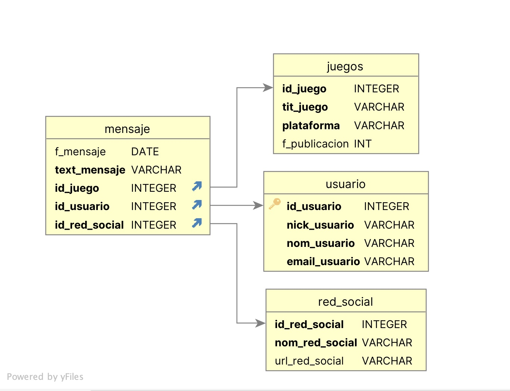
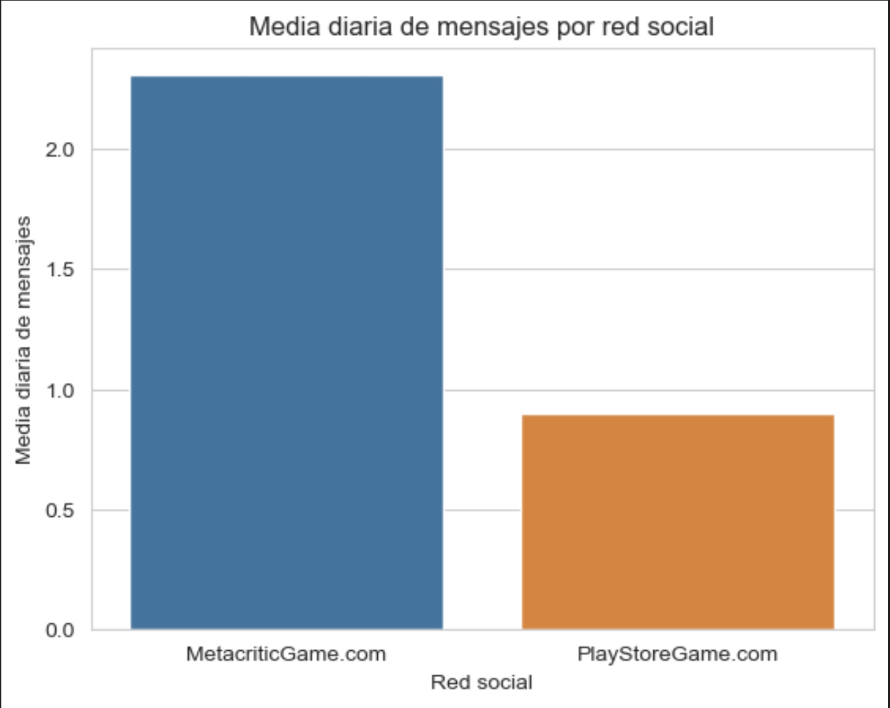
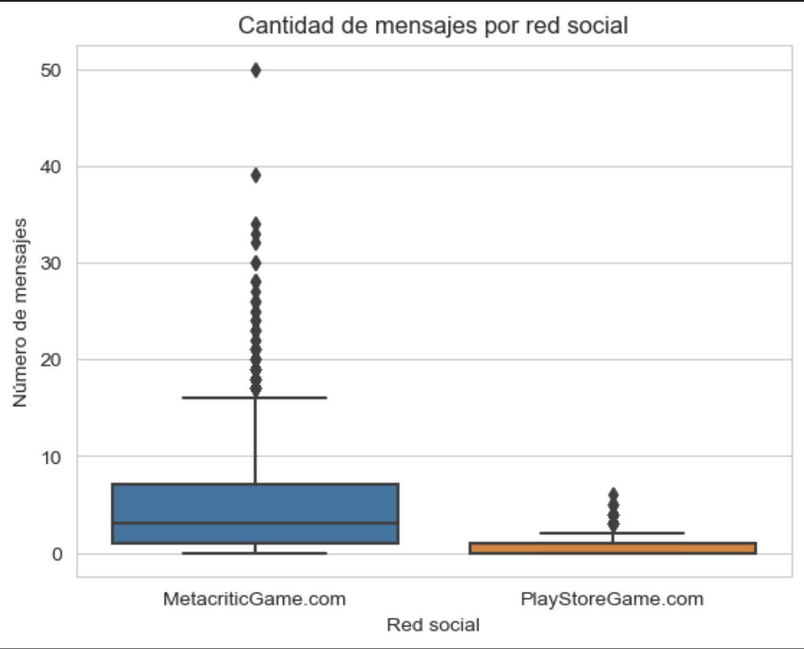

# Videogames Reviews Analysis

## Descripción

El proyecto tiene como objetivo principal la creación de una aplicación sencilla que permita gestionar los mensajes obtenidos de diversos videojuegos en diferentes redes sociales. Esta aplicación se desarrolla a solicitud de una empresa de videojuegos y se utiliza para consolidar y analizar comentarios y feedback de jugadores.

## Herramientas y Tecnologías

- **Python:** Para la extracción transformación y carga de datos de distintas fuentes y la creación de módulos diferenciados para el orden dentro de la aplicación
- **Pandas:** Para manipular los datos desde formatos distintos (.csv, .json) y analizarlos desde variables del tipo dataframes, lo que facilita el análisis y el almacenamiento.
- **Beautifulsoup:** Para realizar webscraping a distintas páginas de reviews de videojuegos e integrarlos a la base de datos
- **SQLite3:** La conexión de python al dbms sqlite3 permitió el almacenamiento de las tablas dentro de una base de datos relacional y la generación de consultas desde una interfaz de usuario como jupyter notebook. 
- **Matplotlib** y **Seaborn:** Para visualizar datos y analizar patrones y tendencias en los reviews de videojuegos

## Características Principales
### Ingesta de Datos: 

La aplicación puede importar comentarios desde diversas fuentes:
- Play Store Game a través de archivo **json** (PlayStoreGameAppInfoReview.json)
- Metacritic Game desde un archivo **csv** (metacritic_game_user_comments.csv)
- Extracción de comentarios directamente desde ciertas páginas web a través de **webscraping**.

### Almacenamiento Unificado: 

Todos los comentarios y mensajes son almacenados en una base de datos relacional, manteniendo una estructura uniforme independientemente de su origen. La base de datos ha sido estructurada con primary and foreign keys, con sus respectivos constraints para garantizar la integridad de los datos y la correcta relación entre las tablas. 

  

### Interfaz de Usuario: 

Se proporciona una interfaz de usuario sencilla, accesible a través de Jupyter Notebook, que permite:
- Carga inicial de datos de juegos y plataformas.
- Adición de mensajes (reviews) a la base de datos, vinculando cada mensaje con un videojuego específico.
- Realización de consultas específicas sobre los mensajes almacenados.

### Consultas:

Las consultas que se pueden realizar desde la base de datos a través de jupyter notebook son:
- **Rango de Fechas y Texto:** Proporciona dos fechas y un texto para obtener una lista de usuarios que mencionan el texto en sus comentarios durante ese periodo.
- **Mensajes por Usuario:** Muestra la cantidad de mensajes que cada usuario ha publicado.
- **Media de Mensajes Diarios:** Indica un rango de fechas y obtén un histograma que muestra la media de mensajes diarios por red social.
- **Estadísticas por Tema:** Define un tema a través de un conjunto de palabras clave y descubre en qué red social se habla más sobre ese tema.

  
   

## Conclusiones:
En "Videogames Reviews Analysis", fortalecí habilidades esenciales en análisis e ingeniería de datos al gestionar comentarios de jugadores de diversas redes sociales. Usando Python, integré bibliotecas como Pandas y BeautifulSoup para procesar datos de forma eficiente. La adopción de SQLite3 permitió un almacenamiento y consulta de datos ágil, resaltando mi capacidad para combinar diversas tecnologías en análisis de datos. Este proyecto subraya mi capacidad para realizar tareas como Data Engineer o Data Analyst, enfatizando la integración de herramientas y adaptabilidad.
